# API Deployment
We're done writing our Lambdas and we're ready to deploy our SAM application.  The `sam-local` package we've been using to test our functions locally has some helpful utilities for deployment, so we'll take advantage of these.

## Finishing Touches

One more thing that would be useful would be if the stack outputted the API Gateway endpoint after provisioning the resources.  Let's add an output to do this, at the root level below the `Description` property:
```yaml
Outputs:
  ApiEndpoint:
    Description: The endpoint of the Prod stage of the implicit API Gateway resource
    Value: !Sub "https://${ServerlessRestApi}.execute-api.${AWS::Region}.amazonaws.com/Prod/"
```

---

Here's the final template for reference:

```yaml
AWSTemplateFormatVersion: 2010-09-09
Transform: AWS::Serverless-2016-10-31
Description: A serverless poll app
Outputs:
  ApiEndpoint:
    Description: The endpoint of the Prod stage of the implicit API Gateway resource
    Value: !Sub "https://${ServerlessRestApi}.execute-api.${AWS::Region}.amazonaws.com/Prod/"
Resources:
  Polls:                   
    Type: AWS::Serverless::SimpleTable
    PrimaryKey:
      Name: id
      Type: String
    ProvisionedThroughput:
      ReadCapacityUnits: 5
      WriteCapacityUnits: 5
  CreatePoll:
    Type: AWS::Serverless::Function
    Properties:
      CodeUri: ./dist/createpoll/createpoll.zip
      Runtime: nodejs6.10
      Handler: index.handler
      Timeout: 120
      Events:
        CreatePoll:
          Type: Api
          Properties:
            Path: /polls
            Method: POST
      Policies: AmazonDynamoDBFullAccess
      Environment:
        Variables:
          TABLE_NAME: !Ref Polls
  GetPoll:
    Type: AWS::Serverless::Function
    Properties:
      CodeUri: ./dist/getpoll/getpoll.zip
      Runtime: nodejs6.10
      Handler: index.handler
      Events:
        CreatePoll:
          Type: Api
          Properties:
            Path: /polls/{id}
            Method: GET
      Policies: AmazonDynamoDBReadOnlyAccess
      Environment:
        Variables:
          TABLE_NAME: !Ref Polls
  ListPolls:
    Type: AWS::Serverless::Function
    Properties:
      CodeUri: ./dist/listpolls/listpolls.zip
      Runtime: nodejs6.10
      Handler: index.handler
      Events:
        CreatePoll:
          Type: Api
          Properties:
            Path: /polls
            Method: GET
      Policies: AmazonDynamoDBReadOnlyAccess
      Environment:
        Variables:
          TABLE_NAME: !Ref Polls
  CastVote:
    Type: AWS::Serverless::Function
    Properties:
      CodeUri: ./dist/vote/vote.zip
      Runtime: nodejs6.10
      Handler: index.handler
      Events:
        CreatePoll:
          Type: Api
          Properties:
            Path: /polls/{id}/answer/{answerIndex}
            Method: PATCH
      Policies: AmazonDynamoDBFullAccess
      Environment:
        Variables:
          TABLE_NAME: !Ref Polls
```

That should do it for the template.  Let's move on to packaging.

## Package

We can ensure our template is syntactically correct by running:
```bash
$ sam validate
```
If there are no errors, the output should be `Valid!`.  Note that this does not ensure that our template will provision its defined resources without issue, but simply that its syntax is valid.

We're now just about ready to deploy, but we need *one more thing*.  Since we've used local path references to our code in the template, if we deployed the template as-is CloudFormation would have no way of accessing the code, which is only stored locally on our development machine.  Luckily, CloudFormation provides a `package` operation that is designed to make this very easy.  This takes a template file, uploads all of the referenced files to an S3 bucket, and outputs a new template that references the S3 objects instead of the local paths.  To take advantage of this, we'll need to provision an S3 bucket for it to use to store the code.  You can do this via the console or the CLI:
**The region you use here must be the same region you'd like to deploy the application to.**
```bash
$ aws s3api create-bucket --bucket my-poll-app-cfn --region us-west-2 \
    --create-bucket-configuration LocationConstraint=us-west-2
```
I've used `my-poll-app-cfn`, but remember that S3 buckets are globally unique, so you'll have to choose something else for your bucket name.  Also note that for this particular CLI call, any region outside of us-east-1 requires the `LocationConstraint` parameter passed to `--create-bucket-configuration`.  

Run `webpack` one more time to be sure that our packages are up-to-date.

Run the package command, specifying the bucket we just created:
```bash
$ sam package --template-file template.yml --s3-bucket my-poll-app-cfn --output-template-file template-packaged.yml
```
Note that you can also use `aws cloudformation` instead of `sam` as the root command with the same parameters to get the same result.  The `sam` command is just an alias.

Let's take a quick look at the `template-packaged.yml` file that was generated. Here's a snippet containing our `CastVote` resource:
```yaml
CastVote:
    Properties:
      CodeUri: s3://my-poll-app-cfn/51d31d05f68d1c495f3e25f5614d8f5d
      Environment:
        Variables:
          TABLE_NAME:
            Ref: Polls
      Events:
        CreatePoll:
          Properties:
            Method: PATCH
            Path: /polls/{pollId}/answer/{answerIndex}
          Type: Api
      Handler: index.handler
      Policies: AmazonDynamoDBFullAccess
      Runtime: nodejs6.10
    Type: AWS::Serverless::Function
```
Notice that the previously local path in the `CodeUri` property has been replaced with an S3 object URI.

## Deploy

The time has finally come.  Let's deploy the stack:
```bash
$ sam deploy --template-file template-packaged.yml --stack-name my-poll-app-api --capabilities CAPABILITY_IAM --region us-west-2
```
We're specifying the `-packaged` version of the template that we just generated, giving the stack a name (this will be used to prefix the generated names for all of our resources, so I would recommend using something you will recognize, like *yourinitials-poll-app-api*, as we'll need to find resources in the console).

You should get some output that confirms a successful deployment.

*Note: if there is a problem with the stack creation and you need to fix something, you can remove the failed stack, which will be stuck in a `ROLLBACK_COMPLETE` state and thus won't let you redeploy the same stack, with the following:*
```bash
$ aws cloudformation delete-stack --stack-name my-poll-app-api --region us-west-2
```

## Manually configure CORS
Unfortunately there is currently not a trivial way to enable CORS on an API Gateway resource easily from CloudFormation.  The only current method involves including and referencing a Swagger file in the SAM template, which is a method of documenting a RESTful API in a way that a consumer application can parse and understand and opens the possibility for auto-generation of client abstractions for APIs (think WSDL for REST, if you're familiar with SOAP APIs).  While this is very cool, it is a fairly involved task even for a simple API such as what we've made here, and is thus beyond the scope of this tutorial, so for now we'll do this configuration manually in the console (boo!).  Note that there is an open issue on the SAM issue tracker and soon this should be as simple as adding a `cors:true` parameter to each API Gateway resource that we'd like to enable CORS on. 

Head to the API Gateway console and select our API:
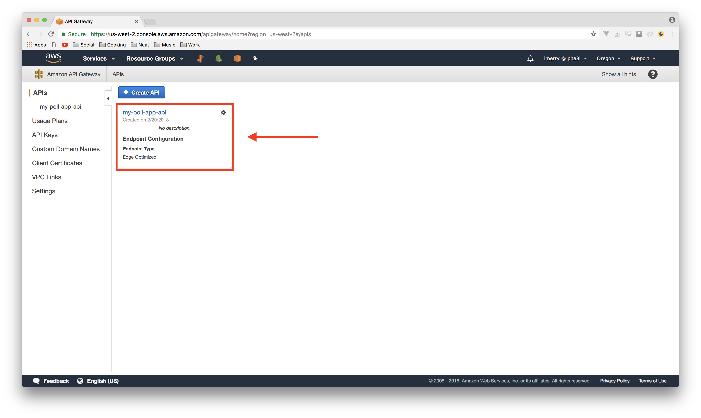

Select the `/polls` resource:
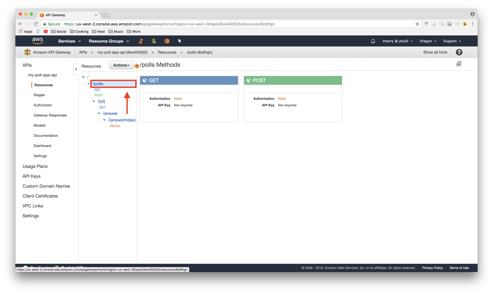

In the `Actions` menu, select `Enable CORS`:
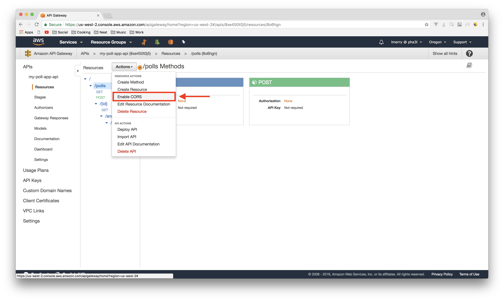

Leave everything default and select `Enable CORS and replace existing CORS headers`:
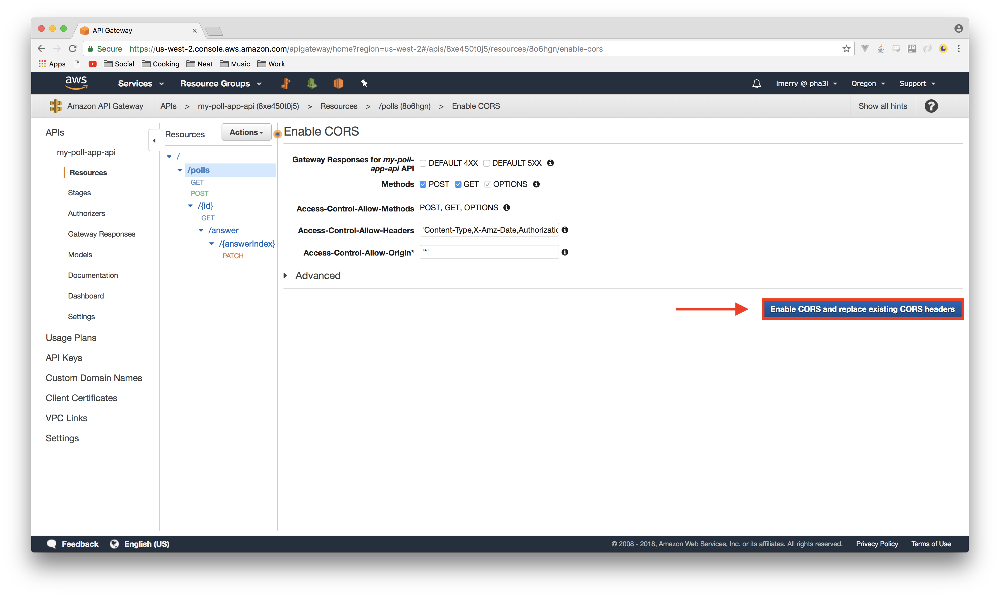

You'll now see a page showing the status of the operation, including a few errors.  Here's where things get a little annoying.  We need to specify the status codes we want to enable CORS for, and then run the CORS wizard ***again***.
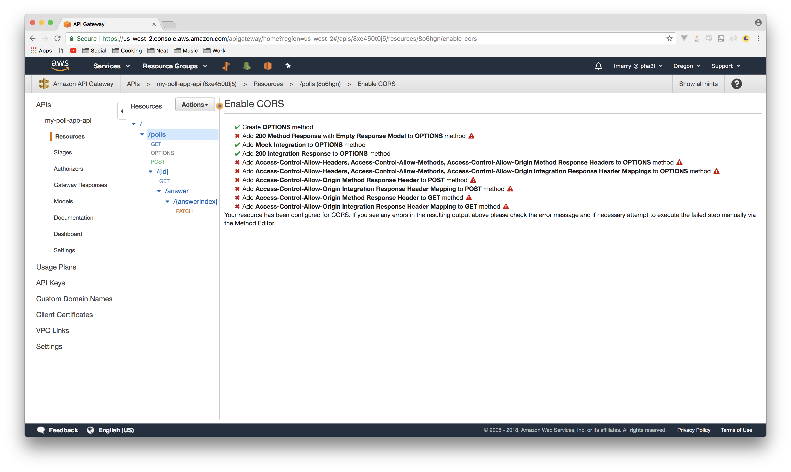

Select the `get` method of the root resource:
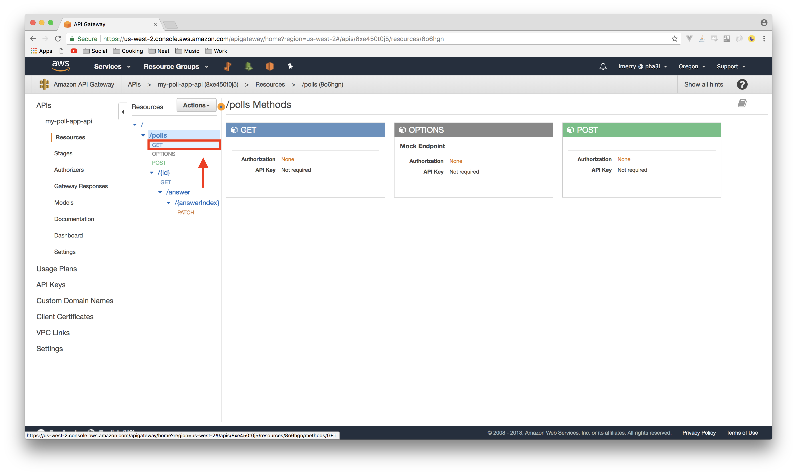

Select the `Method Response` execution stage:
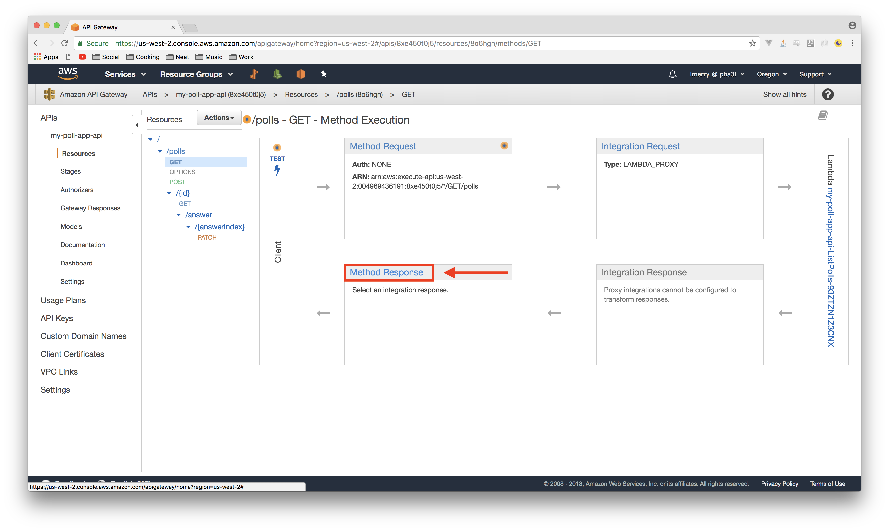

Select `Add Response`:
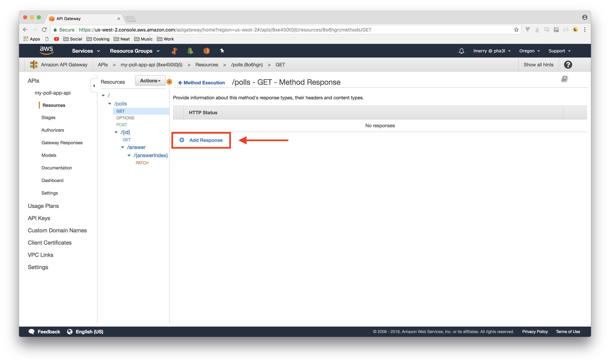

Enter `200` for the status code and click the checkmark button:
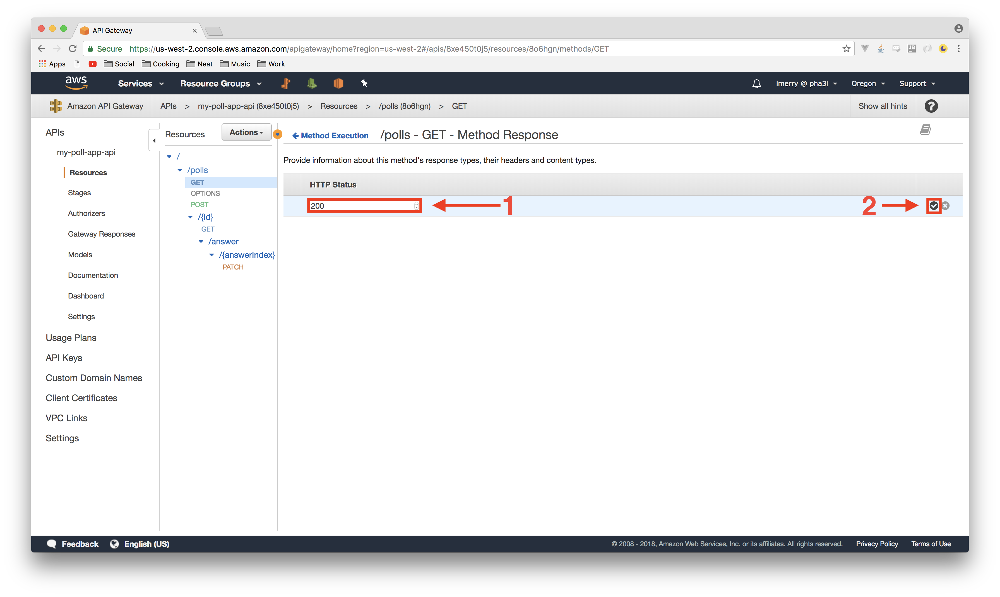

**REPEAT** these steps for the `OPTIONS` and `POST` methods of the `/polls` resource, specifying the `200` response code.
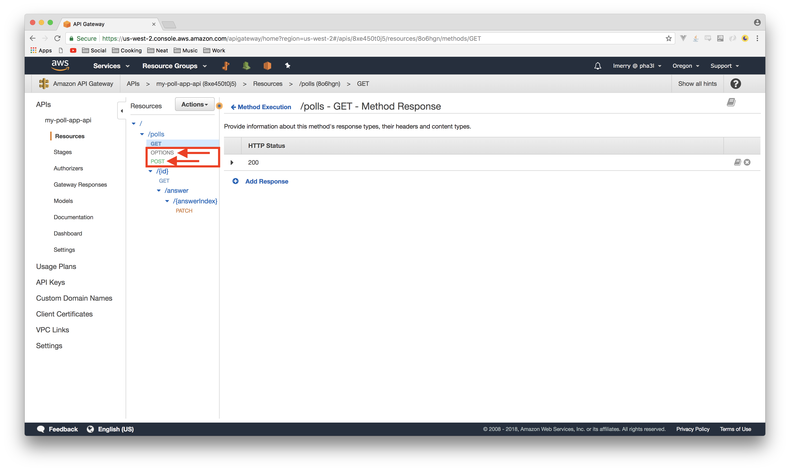

Go back to the root `/polls` resource and run the `Enable CORS` wizard once again:


Repeat ALL of these steps for the `/{answerIndex}` resource:


Finally, select `Deploy API` from the Actions menu:
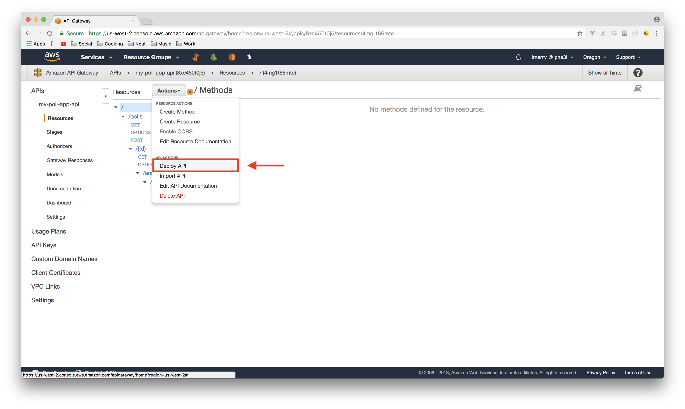

Choose the `Prod` stage and `Deploy`:

---

It's a bit silly how difficult this is to accomplish currently, but it does do the trick and you only ever have to do it once.  Also, as I mentioned earlier, this should be fixed hopefully very soon.  We now have a fully CORS-enabled API ready to consume with a client application, so let's get busy building it in the next section!